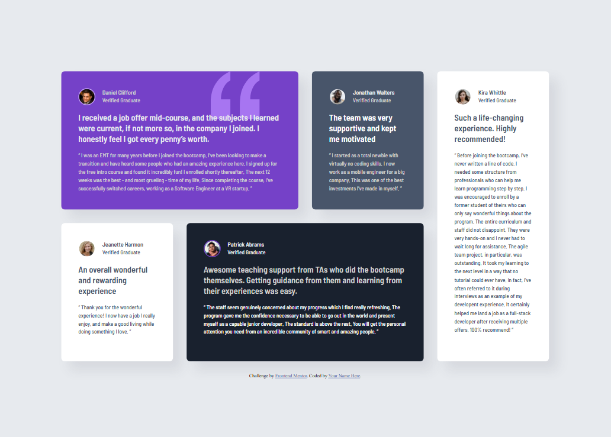

# Frontend Mentor - Testimonials grid section solution

This is a solution to the [Testimonials grid section challenge on Frontend Mentor](https://www.frontendmentor.io/challenges/testimonials-grid-section-Nnw6J7Un7). Frontend Mentor challenges help you improve your coding skills by building realistic projects.

## Table of contents

- [Overview](#overview)
  - [The challenge](#the-challenge)
  - [Screenshot](#screenshot)
  - [Links](#links)
- [My process](#my-process)
  - [Built with](#built-with)
  - [Useful resources](#useful-resources)

## Overview

### The challenge

Users should be able to:

- View the optimal layout for the site depending on their device's screen size

### Screenshot

### Links

- Solution URL: [ solution URL ](https://your-solution-url.com)
- Live Site URL: [ Live Site URL ](https://arrifuber.github.io/Testimonial-Grid-Section/)

## My process

### Built with

- Semantic HTML5 markup
- CSS custom properties
- Flexbox
- CSS Grid
- Mobile-first workflow
- SASS / SCSS

### Useful resources

- [W3 Scholls](https://www.w3schools.com/cssref/pr_grid-area.php) - about grid area

## Author

- GitHub - [ArrifUber](https://github.com/ArrifUber)
- Frontend Mentor - [@ArrifUber](https://www.frontendmentor.io/profile/ArrifUber)
